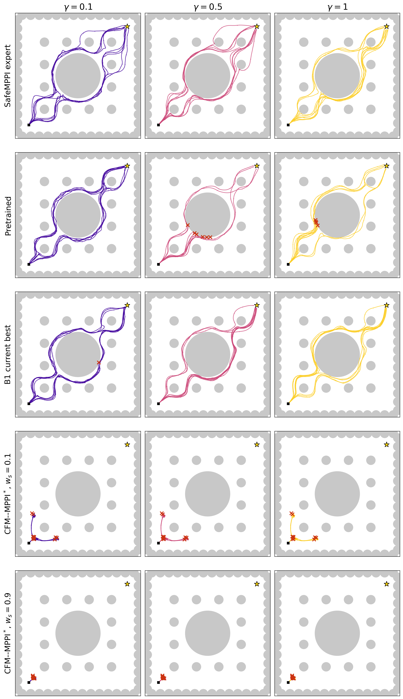

# B1_current_best handoff

`B1_current_best` is the frozen working name for the selected B1 arm and its
pre-holdout-selected checkpoint. It supersedes Phase C as the current empirical
best on the canonical giant-obstacle task; Phase C remains preserved as a
negative historical result.

## Identity and scientific status

- Training source commit: `63ebefa7877c0b923c1c7cdea19228302dd6a0ca`.
- Additive recovery/finalizer commit: `ba699bc42dfd393a3bffb4f97b3fe3e425c813d5`.
- Additive gallery/low7-Kazuki adapter commit:
  `e6c145ff5ae7a4ca2dd1c07761d2a377825d3615`.
- Arm: `cap512_ess025_alpha0010_cost`.
- Selected checkpoint: round 19, fixed by the M10 screening before the disjoint
  M50 holdout was read.
- Pretrained checkpoint SHA-256:
  `524c9c0a4fd071221ac509b9d8e6fbbfb85fdf1811aa04160317f2a9e2d3ef90`.
- Selected checkpoint SHA-256:
  `60c155472f5ed0e4a1d53581857f09aead7924f8ce11e8e3adf890d5a57fc079`.
- Scene SHA-256:
  `356d6d48b3af2b017b529562b530f35285c86f9107da512a73de6ef664b03e72`.
- Delivery status: scientifically complete and hash-revalidated, but explicitly
  `RECOVERED_NONCANONICAL` because a foreign process violated the original
  two-GPU exclusivity contract during final artifact assembly. Training and the
  disjoint M50 evaluation had already completed; the recovery reran no science.

## Exact recipe

The environment is `low7_radius1_canonical_v1`: start `(0.3,0.3)`, goal
`(4.7,4.7)`, one unseen radius-1.0 obstacle at `(2.5,2.5)`, seven fixed
conditioning levels, horizon `H=10`, and fail-closed NVP termination.

| Component | B1_current_best value |
|---|---|
| Model input | low7 with closest-boundary tie-mean vector; reflection group-averaged policy |
| Expansion rounds | 20; selected checkpoint r19 |
| Closed-loop gathering | 8 synchronous replicas per gamma; `T=300` |
| Proposal/query budget | `K=16`, `B=4`; all solved selected-B queries enter cumulative D |
| Positive label | full-H SOCP positive (or certified terminal prefix); all positives enter cumulative D+ |
| Execution | nominal-Hp-eligible plan minimizing the exact SafeMPPI execution cost; execute first action only |
| Failure | no expert or fallback; NVP terminates only that replica |
| Uncertainty | RBF posterior variance at `s=0.9`; `ell=0.20032394292220754`; `lambda=1e-2`; cap 512 |
| GP memory | positive acquisition support from current and previous round (`W=2`), current-model re-embedding |
| Acquisition | sequential without replacement; adaptive beta targets normalized ESS 0.25 per gamma |
| Replay | current and previous round (`W=2`); every eligible D+ example exactly once without replacement |
| Replay measure | equal mass over gamma -> (round, episode) -> context -> positive query |
| Optimizer | batch 128, lr `1e-5`, dynamic `ceil(eligible positives / 128)` steps, frozen visual encoder |
| Negative signal | NVP-context selected-B population; signed gradient alpha `0.01` with gradient-norm scaling |
| Excluded | expert/demo replay, fallback, prox, anchor, curriculum, rollback, and recovery starts |
| Scientific evaluation | separate raw, untilted, temperature-1, disjoint `M=50/gamma` seed bank |

The complete machine-readable recipe is
[`configs/b1_current_best_recipe.json`](configs/b1_current_best_recipe.json).

### B1-specific equations

If several obstacle boundaries have the same minimum distance at the numerical
tie tolerance, the raw boundary feature is their mean rather than whichever
obstacle happens to appear first:

\[
d_{\rm boundary}(p)=\frac{1}{|\mathcal T(p)|}
\sum_{o\in\mathcal T(p)} d_o(p),\qquad
\mathcal T(p)=\arg\min_o\|d_o(p)\|.
\]

Let \(R\) swap the x/y axes in the action window, raw condition, history, and
polar grid. The deployed velocity is the exact two-element group average

\[
v_\theta^{G}(x_\tau,\tau,c)=\tfrac12\left[
v_\theta(x_\tau,\tau,c)+
R\,v_\theta(Rx_\tau,\tau,Rc)\right].
\]

This is architectural averaging at inference, not a route-count penalty. The
selected execution plan is

\[
j^*=\arg\min_{j\in\mathcal V_{H}\cap\mathcal V_{H_P}}
J_{\rm SafeMPPI}(U^{(j)};c,\gamma),
\]

where \(\mathcal V_H\) is the full-H verified set and
\(\mathcal V_{H_P}\) passes the nominal one-step level-set condition. The NVP
negative term is combined at gradient level,

\[
g=g_+-\rho g_-,\qquad
\rho=\alpha\frac{\|g_+\|_2}{\|g_-\|_2},\qquad \alpha=0.01.
\]

It is therefore not equivalent to adding a fixed scalar multiple of a negative
MSE to the loss.

## Critical result

The disjoint raw temperature-1 M50 confirmation contains 350 rollouts per
checkpoint.

| Checkpoint | SR | CR | Timeout | V_safe | V_full | Successful U/R | Clearance, all |
|---|---:|---:|---:|---:|---:|---:|---:|
| r0 | 57.43% | 42.57% | 0% | 18.29% | 13.14% | 94/107 | 0.0171 m |
| **r19 selected** | **96.00%** | **4.00%** | 0% | **86.29%** | **49.71%** | **174/162** | **0.0557 m** |
| r20 diagnostic | 96.29% | 3.71% | 0% | 87.14% | 48.57% | 175/162 | 0.0557 m |

r20 is not retroactively promoted: r19 was fixed before the disjoint holdout.
The selected checkpoint preserves both successful route modes in this seed bank,
unlike Phase C.

## B1 max-margin metric goal (2026-07-21)

An additive experiment changed only the expansion execution law to
nominal-Hp-gated single-step maximum margin and selected the strongest declared
B1 arm: RBF cap 768, adaptive ESS target 0.5, and signed NVP-gradient
`alpha=0.01`. The model was trained for 50 rounds, but the pre-confirmation
calibration selected round 15. The separate raw temperature-1 curves remain the
intrinsic-generator audit; the result below is a **calibrated sampling policy**,
not a temperature-1 claim.

The per-gamma initial-noise temperatures were calibrated on separate M10 banks
and then frozen before a new disjoint M50/gamma confirmation. Evaluation uses
the bare receding-horizon flow only: no RBF acquisition, verifier, fallback, or
expert is active at execution time.

| gamma | temperature | SR | CR | V_safe | clearance [m] | time [s] |
|---:|---:|---:|---:|---:|---:|---:|
| 0.1 | 0.30 | 1.00 | 0.00 | 0.98 | 0.0683 | 18.86 |
| 0.2 | 1.00 | 1.00 | 0.00 | 0.96 | 0.0678 | 16.17 |
| 0.3 | 0.30 | 1.00 | 0.00 | 1.00 | 0.0655 | 15.34 |
| 0.4 | 0.30 | 1.00 | 0.00 | 1.00 | 0.0657 | 15.04 |
| 0.5 | 0.75 | 1.00 | 0.00 | 1.00 | 0.0597 | 14.89 |
| 0.7 | 0.75 | 1.00 | 0.00 | 0.98 | 0.0526 | 14.87 |
| 1.0 | 0.45 | 1.00 | 0.00 | 1.00 | 0.0501 | 14.50 |

Thus all 350 confirmation episodes succeed without collision, `V_safe` is
96--100%, lower gamma has higher clearance overall, and higher gamma reaches
the goal faster. The 0.00015 m clearance inversion between gamma 0.3 and 0.4
is much smaller than either cell's standard error and is not treated as a
meaningful ordering violation.

Exact recipe and metrics:
[`configs/b1_margin_goal_recipe.json`](configs/b1_margin_goal_recipe.json) and
[`provenance/b1_margin_goal/final_m50.jsonl`](provenance/b1_margin_goal/final_m50.jsonl).

The 5x3 gallery uses only gamma 0.1, 0.5, and 1.0. Raw rows are fixed
non-curated M50 indices 0--9. A red X marks the terminal position of every
non-successful trajectory and has no text label. The Kazuki rows use
`goal_coef=0` and the predeclared original safety-grid endpoints
`safe_coef=0.1` and `0.9`; both timed out in all ten diagnostic episodes. Their
closest-obstacle route-value standard deviations were respectively 0.700 and
0.057, so the high-safety setting visibly concentrates much more strongly. The
zero-safety diagnostic is preserved in the gallery provenance, but it is not a
raw-pretrained control because FlowMPPI refinement remains active.

- [Vector PDF](assets/results/b1_current_best/b1_current_best_5x3_gallery.pdf)
- [Gallery manifest and fixed rollout archives](provenance/b1_current_best/gallery/gallery_manifest.json)

## Paper-ready figures (2026-07-20)

Two scripts under `scripts/` render the camera-ready evolution and mode
figures with serif/Computer-Modern mathtext (no TeX install required; set
`USE_TEX=True` in the config block if LaTeX is available) into
`assets/paper/` as PNG (300 dpi) plus vector PDF. Subplot titles, labels, and
font sizes are collected in the `TITLES`/`FONT` dictionaries at the top of
each script.

- `scripts/paper_b1_evolution_curves.py` →
  `b1_evolution_grid.{png,pdf}` (SR / CR / V_safe / V_full / clearance /
  time-to-goal / U/R balance / J over rounds 0–20) and
  `b1_evolution_compact.{png,pdf}` (J-vs-round + SR-vs-J trajectory).
  Thin curves are the per-γ raw temperature-1 **M10 screening** of every
  round checkpoint (`provenance/b1_current_best/screening_m10_metrics.jsonl`,
  copied verbatim from the sweep output; provenance JSON alongside); the
  black pooled curve carries Wilson/bootstrap bands, and the orange stars are
  the disjoint **M50 confirmation** at r0/r19/r20 — only the stars are the
  scientific result.
- `scripts/paper_b1_mode_gallery.py` →
  `b1_mode_gallery_m50.{png,pdf}`. Renders **all 50** retained raw
  temperature-1 M50 confirmation rollouts per (round, γ) cell from
  `provenance/b1_current_best/cells/` — the exact evaluation rollout
  strategy, no re-rolling and no curation. Successes are classified into
  four lanes by the signed perpendicular offset to the start–goal diagonal
  at the closest pass to the giant obstacle (the same signed quantity behind
  the official U/R metric), split inner/outer at |offset| = 0.7; a histogram
  strip under each panel shows the lane clusters. At r19 all four lanes are
  populated at every rendered γ (sharp clusters); at r0 the γ=0.5 outer
  lanes are nearly empty (RO 2 / UO 3, 30 failures) and offsets are smeared.
  The lane split is a declared visualization heuristic, not a homotopy
  classification.

## Clearance definition and the apparent low-gamma discrepancy

The legacy `minimum_clearance.mean` is computed in two stages:

1. For each trajectory, take the minimum Euclidean clearance over **every
   state and every obstacle/wall**.
2. Average those minima over **all trajectories**, including collisions.

Thus it is neither an average clearance along the path nor a clearance only to
the giant obstacle. Failures do depress the value, but they do not explain the
visual impression by themselves. At r20, gamma 0.1 is `0.0491 m` over all 50
episodes and `0.0549 m` over the 45 successes; the five failures average
`-0.0030 m`. At r19, the pooled all/success/failure means are respectively
`0.0557 / 0.0581 / -0.0034 m`.

The exact decomposition is in
[`provenance/b1_current_best/clearance_breakdown.csv`](provenance/b1_current_best/clearance_breakdown.csv).
The complete r0/r19/r20 M50 cell archives used for this calculation and the
fixed-index gallery are retained under `provenance/b1_current_best/cells/`.

## Code locations

The runnable originals live under
`overnight_run_07_06/rev_expansion/codex_overnight/` in the safeMPPI repository;
the matching files are copied under `source_snapshot/` here.

| File | Responsibility | Main blind spot |
|---|---|---|
| `run_low7_b1_balanced_sweep.sh` | frozen launcher and resource/provenance gates | Helios-specific paths and GPU UUIDs |
| `analysis/low7_b1_balanced_sweep_driver.py` | 24-arm matrix, screening, selection, disjoint holdout | finite-M screen selects a checkpoint, not a theorem |
| `grid_expand_afe_rbf.py` | replicas, proposals, RBF acquisition, verifier, replay, update | finite-H positives do not prove recursive viability |
| `afe_rbf_core.py` | RBF posterior and cap-512 memory | uncertainty depends on learned representation and capped support |
| `afe_execution.py` | nominal-Hp gate and SafeMPPI-cost execution | local execution cost is not a global coverage constraint |
| `afe_signed_update.py` | NVP negative-gradient combination | task-specific terminal negative population |
| `afe_context.py` | tie-mean closest-boundary low7 context | compresses multi-obstacle geometry into one 2-vector |
| `paper_results/low7_raw_m50_eval.py` | raw temperature-1 holdout and metrics | legacy clearance average includes failures |
| `paper_results/b1_current_best_gallery.py` | fixed 5x3 expert/raw/Kazuki comparison and red-X rendering | Kazuki rows are diagnostic M10 timeouts, not a competitive success baseline |
| `kazuki_baseline.py` | faithful CFM-MPPI baseline plus an additive low7 context adapter | zero guidance still leaves MPPI refinement active |
| `analysis/finalize_low7_b1_balanced_sweep.py` | no-science recovery and artifact validation | cannot restore the original exclusivity contract |

## Handoff rule

New agents should begin with this file, verify the package, and reproduce from
the r19 checkpoint. They must not call the controller-induced gathering plots a
raw evaluation, must not promote r20 post hoc, and must preserve the explicit
noncanonical recovery status. `goal_coef=safe_coef=0` in the current Kazuki
implementation is **not** raw pretrained behavior because FlowMPPI refinement
still runs; the raw pretrained row is the correct zero-guidance control.
