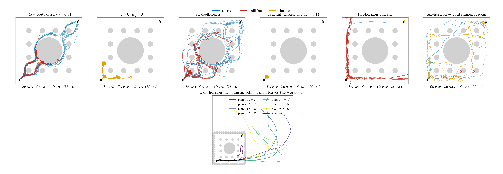

# Kazuki CFM-MPPI on the canonical giant-obstacle task: collapse test and faithful transplant

Date: 2026-07-20. Scene `low7_radius1_canonical_v1`; proposal model = the B1
pretrained FM (`524c9c0a…`, tie-mean low7, reflection group-averaged);
`gamma_ctx=0.5`; `T=300`; `reach=0.15`; the gallery's named-seed stream
extended to M=50. Reference implementation:
`external_data/kazuki_cfm_mppi` in the safeMPPI repository. Runners:
[`scripts/run_kazuki_faithful_m50.py`](scripts/run_kazuki_faithful_m50.py),
[`scripts/run_kazuki_fullhorizon.py`](scripts/run_kazuki_fullhorizon.py);
figure: [`scripts/paper_kazuki_comparison.py`](scripts/paper_kazuki_comparison.py).

## 1. Fidelity audit: what our port realizes

Verified against the reference sources (file:line reads, not the docstring):

| Axis | Their reference | Our port (`kazuki_baseline.py`, snapshot) | Faithful? |
|---|---|---|---|
| Guided generation | `run_CFM` (eval_utils.py:17-81): endpoint estimate `x1 = z + (1-tau) v`, vmapped CBF/goal grads on `x1`, grads renormalized to the global `‖v‖`, markup `1.01^reversed-t` | identical form | yes |
| CBF reward | reward.py: `sum_t min{0, hdot + a·h}`, K=5 worst obstacles weighted [5..1] | identical, DI form | yes |
| MPPI refinement | flowmppi.py:144-314: top-10 elites, 200 Gaussian copies each, per-mode softmax (lambda 0.1), argmin refined mode | identical | yes |
| Stage cost | mppi/utils.py:69-98: `0.1·goal + 100(1+0.99^t)·clamp(exp(-20(d-r)),1)` + `0.1‖u_t-u_{t-1}‖` smoothness | identical (+ terminal, + warm-start consistency variant) | yes |
| Warm start | eval loop: SINGLE best refined plan broadcast to all 200 samples, `x = 0.8·prev + 0.2·noise`, ODE resumed from tau=0.8 (verified: `synthesize_control` returns `x_sin [1,2,H]` — **not** per-sample population persistence) | same, tau=0.75 (nearest knot on our linear i/8 grid) | yes (knot shift declared) |
| Mixed safety batch | 5 coefs x 40 samples (`safe_margin_coefs`) | identical | yes |
| **Horizon** | **HORIZON=80 = the entire episode**: the flow proposes complete start-to-goal control sequences; executed past is inpainted; the plan shrinks; goal cost is the TRUE terminal | **H=10 receding windows** (our FM proposes 10-step windows); goal terms act on the window end | **no — the one structural gap** |
| Per-step manifold re-projection | dilute then re-integrate the FULL sequence through the flow from tau=0.8 | impossible with a windowed FM; windowed port re-projects only the 10-step window | no (consequence of the horizon gap) |

The `source_snapshot` copy is the corrected version (per-obstacle collision
radii); the older live copy in the safeMPPI working tree averages obstacle
radii and should not be used.

## 2. Collapse test: `goal_coef=0 && safe_coef=0` vs raw pretrained

Disjoint-style M=50, raw reference = confirmation cell `r000_g0.5`
(temperature 1, no controller):

| Arm | SR | CR | Timeout | Successful U/R | Failure terminals |
|---|--:|--:|--:|--:|---|
| raw pretrained (gamma 0.5) | 0.40 | 0.60 | 0.00 | 9/11 | — |
| `zero` — ws=gc=0, MPPI stage cost active | 0.00 | 0.00 | **1.00** | — | frozen near start, mean (1.0, 0.8), never >2.15 from start |
| `zero_nocost` — all four coefficients zero | 0.44 | 0.56 | 0.00 | 10/12 | spread like raw |

**Answer: no, it does not collapse.** Zero-coefficient Kazuki (the natural
reading — guidance off, their MPPI stage cost still on) produces the maximally
different behavior from the raw generator: a 100% start-corner timeout stall.
The distortion is entirely attributable to the cost-driven refinement layer:
zeroing the stage cost as well (`zero_nocost`) approximately recovers the raw
distribution (SR 0.44 vs 0.40, U/R 10/12 vs 9/11) because elite selection and
the softmax refit become uninformative. There is **no coefficient setting that
makes the pipeline the identity map** on the proposal distribution — but the
all-zero setting is a close approximation, and the active-cost setting is not.

This confirms and sharpens the B1 handoff warning: the gallery's
`goal_coef=safe_coef=0` diagnostic is FlowMPPI-refined behavior, not raw
pretrained behavior.

## 3. Faithful transplants and the local-minimum question

| Arm | M | SR | CR | Timeout | Failure mode |
|---|--:|--:|--:|--:|---|
| `faithful` (windowed port, mixed 5-coef batch, gc=0.1) | 50 | 0.00 | 0.00 | 1.00 | start-corner freeze — terminals within 0.39 of start, tighter than the zero arm |
| `fullh` (full-horizon variant, their weights) | 25 | 0.04 | 0.96 | 0.00 | cost-runaway boundary sprint, wall crash at t≈50-96 |
| `fullh --bounds-w 100` (declared containment repair) | 15 | 0.40 | 0.13 | 0.47 | no giant-obstacle engagement: survivors circle the OUTER perimeter corridor; timeouts wander it |

The full-horizon variant is the closest realization their method admits with a
windowed proposal model: N=200 complete H=250 control sequences built by
batched window chaining of the bare policy (i.e. genuine multi-modal raw
rollouts), their refinement at full horizon with the true terminal cost,
single-best dilution warm start, and fresh proposals for half the population
every 25 steps.

Mechanism, measured:

- The proposals are **good**: at t=0, 133/200 candidates reach the goal
  region, U/R 106/94; the top-10 elites are genuine routes ending at the goal
  on both sides.
- The refinement loop then leaves the manifold: by t=10 the refined best
  plan's positions exit the workspace entirely (x≈11 on a 5x5 field). Their
  stage cost penalizes only obstacle proximity: crossing the wall-scallop ring
  costs a few hundred once, while any interior route accrues 3k-31k of
  proximity cost over 250 steps. **On a walled scene their cost's global
  minimum is to leave the arena.** The executed trajectory sprints east along
  the bottom corridor and crashes into the boundary at t≈50-93 in 25/25
  episodes.
- In the original method this runaway is suppressed by the per-step flow
  re-projection of the full sequence — exactly the component that cannot exist
  with a windowed FM. The windowed port replaces it with window re-projection,
  and there the same cost produces the opposite pathology: the start-corner
  freeze.

**Answer to the local-minimum question:** applied faithfully, the method never
even engages the giant obstacle. The windowed adaptation is stuck in a
start-corner minimum of the MPPI cost (timeout 1.00, and their full protocol
freezes *harder* than zero guidance: the CBF guidance pushes away from the
corner obstacles while the collision cost blocks every exit). The
full-horizon adaptation escapes the corner but follows the cost off the
workspace (collision 0.96). With the single declared containment repair the
method finally reaches the goal in 40% of episodes with collision 0.13 — but
its successes travel the outer perimeter corridor, the cost's remaining
minimum, not the learned diagonal routes; it matches the proposer's raw SR
(0.40 at gamma 0.5) while trading raw collisions (0.60) for timeouts (0.47),
and never crosses the giant-obstacle region at all. The multi-modal routes
around the giant obstacle exist in the method's own proposal set at t=0 and
are discarded by its refinement layer in every configuration. The appropriate
reading is not "CFM-MPPI is stuck in the giant-obstacle local minimum" but
"inference-time cost refinement overrides the learned proposal distribution;
on this walled, dense scene its minima — corner freeze, arena exit, perimeter
orbit — all avoid the region the task is about." For comparison, B1_current_best
solves the same task at SR 0.96 / CR 0.04 by improving the generator itself
and sampling it raw, with no inference-time refinement.

Retained rollouts and summaries: `provenance/kazuki_faithful/` (per-arm npz +
summary JSONs + the t=0..60 plan-evolution trace of fullh episode 0).

Caveats: single scene, single proposal checkpoint, their published cost
weights (tuned for open-space SFM crowds at H=80) transplanted without
re-tuning; the containment repair arm quantifies the open-space assumption
specifically; the bounds arm is M=15. These are diagnostics of the
transplanted method on our task, not of the method in its native setting.
