# Paper baseline assembly

This note defines the local, data-driven baseline-figure interface while the
SafeMPPI-cost expansion arm is running. It does not promote a baseline result.

## Current preview

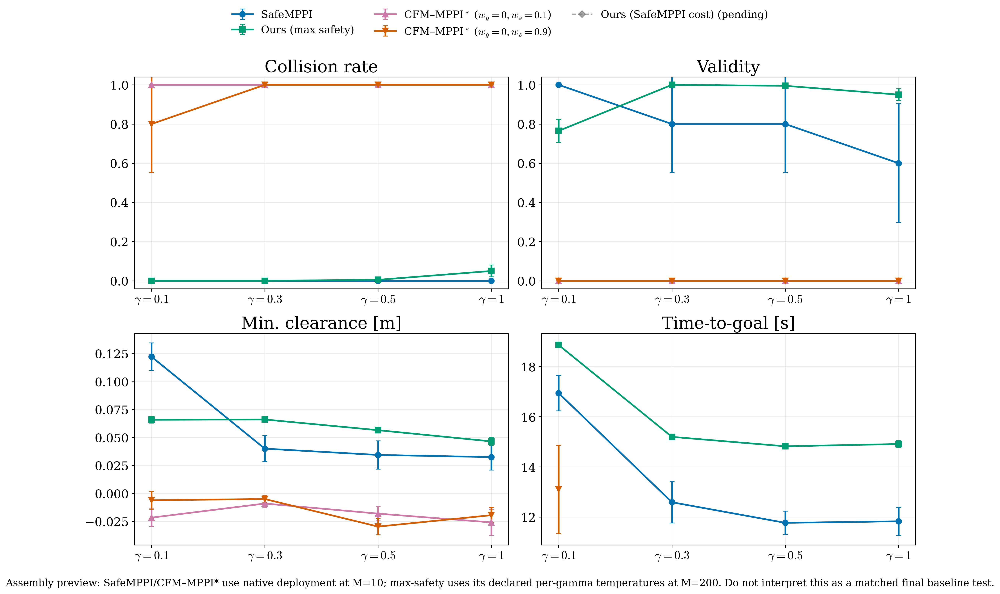

The panels use the canonical giant-obstacle scene and
\(\gamma\in\{0.1,0.3,0.5,1.0\}\). SafeMPPI and CFM--MPPI are fixed-index
\(M=10\) local screens reconstructed from retained trajectories. Their paths
are re-scored with the same sliding-window SOCP validity predicate used by the
raw evaluator. The max-safety expansion is the authenticated round-15
\(M=200/\gamma\) result and retains its declared per-gamma evaluation
temperatures. The SafeMPPI-cost expansion is deliberately `pending`; the
figure contains no imputed value.

Consequently this is an **assembly preview**, not yet a matched comparative
claim. The paper table/figure must be regenerated after every method has the
same seed bank, \(M\), and sampling-temperature contract.

Regenerate:

```bash
python scripts/paper_method_gamma_comparison.py
```

When the new arm finishes:

```bash
python scripts/paper_method_gamma_comparison.py \
  --cost-jsonl /path/to/rounds.jsonl \
  --cost-round ROUND
```

The machine-readable sidecar is
`assets/paper/method_gamma_comparison.json`.

## Native-cost CFM--MPPI coefficient sweep

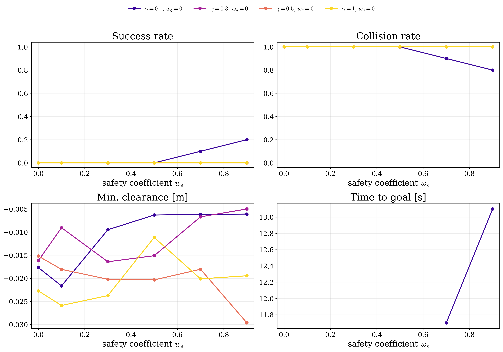

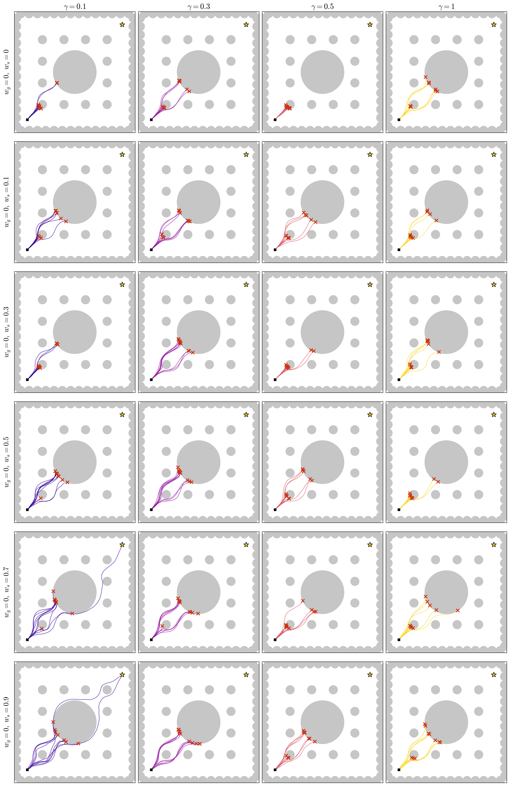

The current local sweep has \(w_g=0\) and
\(w_s\in\{0,0.1,0.3,0.5,0.7,0.9\}\). The same exact B1 SafeMPPI cost is used
at proposal ranking, perturbation weighting, and refined-mode selection. The
renderer does not select a coefficient. In particular, the historical
\(w_s=0.1\) and \(w_s=0.9\) gallery rows were weak/high guidance
visualization endpoints, not winners of an optimization criterion.

The input contract is
[`configs/kazuki_native_cost_sweep.json`](configs/kazuki_native_cost_sweep.json).
Add another `(goal_coef, safe_coef, archive)` entry to compare a new pair;
the metric and overlay figures update without code changes.

Regenerate:

```bash
python scripts/paper_kazuki_coefficient_sweep.py
```

The retained gallery lacked \(\gamma=0.3\). Its local completion is
reproducible with:

```bash
python scripts/prepare_paper_baseline_inputs.py \
  --device cpu \
  --outdir provenance/paper_baselines/local_native_cost_m10_rebuild
```

This command refuses to overwrite its output. The manifest records checkpoint,
source, and output SHA-256 values.

## Absolute Kazuki guidance scale

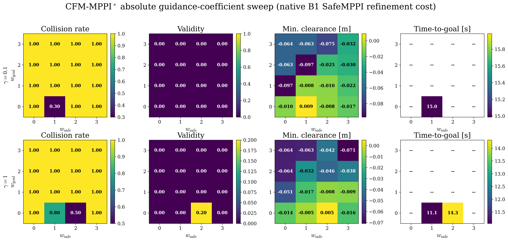

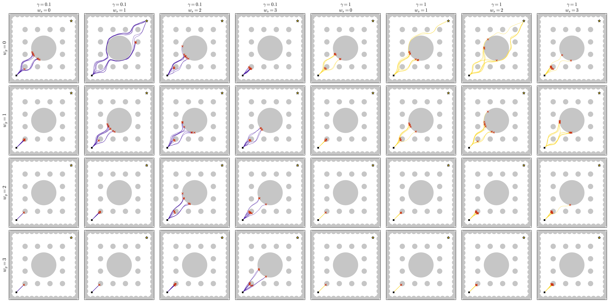

The local common-random-number screen fixes the r19 checkpoint, giant-obstacle
scene, and exact B1 SafeMPPI refinement cost, then evaluates
\((w_{\rm goal},w_{\rm safe})\in\{0,1,2,3\}^2\) at
\(\gamma\in\{0.1,1.0\}\), with \(M=10\) per cell. This tests the absolute
guidance-reward scale rather than treating either coefficient independently.

Only the \(w_{\rm goal}=0\) row produced successes. At \(\gamma=0.1\),
\((0,1)\) achieved SR \(0.7\), whereas at \(\gamma=1\), \((0,2)\) achieved
SR \(0.5\) and Validity \(0.2\). Every \(w_{\rm goal}\ge1\) cell had CR
\(1.0\). The response is therefore strongly non-monotone and
gamma-dependent; the historical \(w_{\rm safe}=0.1/0.9\) rows cannot be
interpreted as calibrated endpoints.

Regenerate the retained trajectories and figures:

```bash
python scripts/run_kazuki_absolute_coefficient_grid.py --device mps --M 10
python scripts/paper_kazuki_absolute_grid.py
```

The raw trajectory archives and complete seed/cost contract live in
`provenance/paper_baselines/kazuki_absolute_grid_m10/`.

## CBF-\(\alpha\) and fine guidance sweep

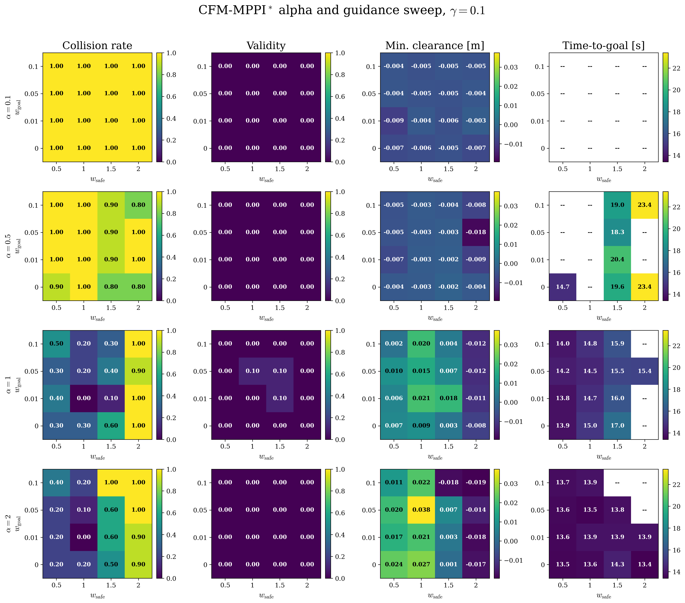

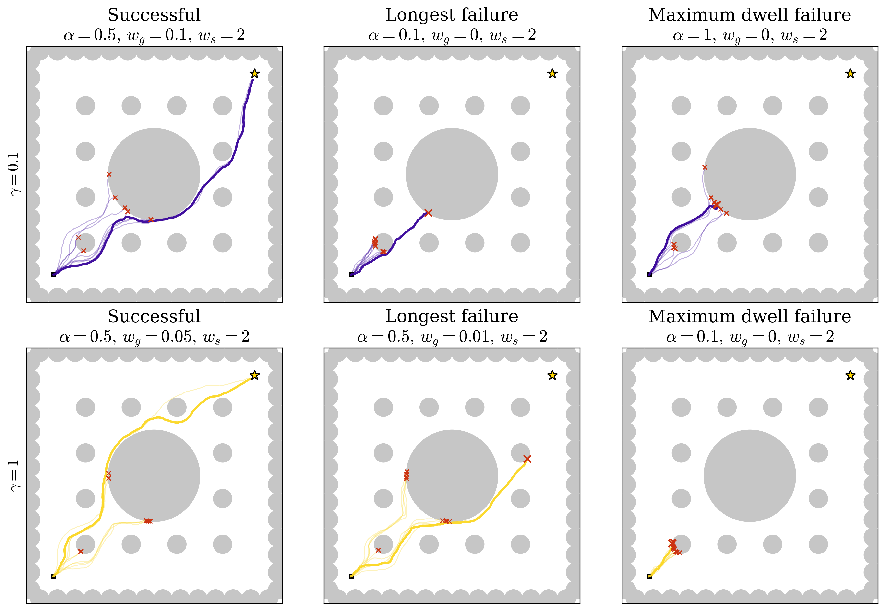

The common-random-number \(M=10\) screen fixes the r19 checkpoint, native
SafeMPPI refinement cost, and giant-obstacle scene. It evaluates

\[
\alpha\in\{0.1,0.5,1,2\},\qquad
w_g\in\{0,0.01,0.05,0.1\},\qquad
w_s\in\{0.5,1,1.5,2\}
\]

at \(\gamma\in\{0.1,1\}\). Here \(w_g,w_s\) scale the flow-guidance
gradients; the native refinement cost still contains its fixed goal term.
All 1,280 rollouts share proposal seeds across coefficient settings.

For \(h>0\), increasing \(\alpha\) makes
\(\dot h+\alpha h\ge0\) easier to satisfy. Thus small, not large,
\(\alpha\) is the more conservative standard-CBF setting. In this
implementation the term is only a soft, globally normalized guidance reward,
so that formal interpretation does not give forward invariance.

| \(\alpha\) | mean SR, \(\gamma=.1\) | mean SR, \(\gamma=1\) | mean Validity, \(\gamma=.1\) | mean Validity, \(\gamma=1\) |
|---:|---:|---:|---:|---:|
| .1 | 0.000 | 0.000 | 0.000 | 0.000 |
| .5 | 0.063 | 0.031 | 0.000 | 0.025 |
| 1 | 0.531 | 0.244 | 0.019 | 0.025 |
| 2 | 0.500 | 0.469 | 0.000 | 0.150 |

These are means over the 16 coefficient pairs, not selected optima. The
highest two-gamma mean SR was \(0.75\) at
\((\alpha,w_g,w_s)=(2,0.01,1)\), but its mean Validity was zero. The highest
mean Validity was \(0.25\) at \((2,0.01,1.5)\), with mean SR \(0.65\).
Coefficient tuning therefore did not jointly recover task completion and
verified trajectory validity.

No episode timed out, so the sweep does **not** establish a stable local
minimum. It does expose a local-minimum-like dwell mode at
\((\gamma,\alpha,w_g,w_s)=(0.1,1,0,2)\): the robot moved only \(2.47\) mm
over its least-moving 20-step interval near the giant obstacle, then
collided. In its exact replay, the cosine between the zero-guidance mean
terminal-plan direction and the guidance-induced terminal-plan shift was
negative for \(78.4\%\) of steps.

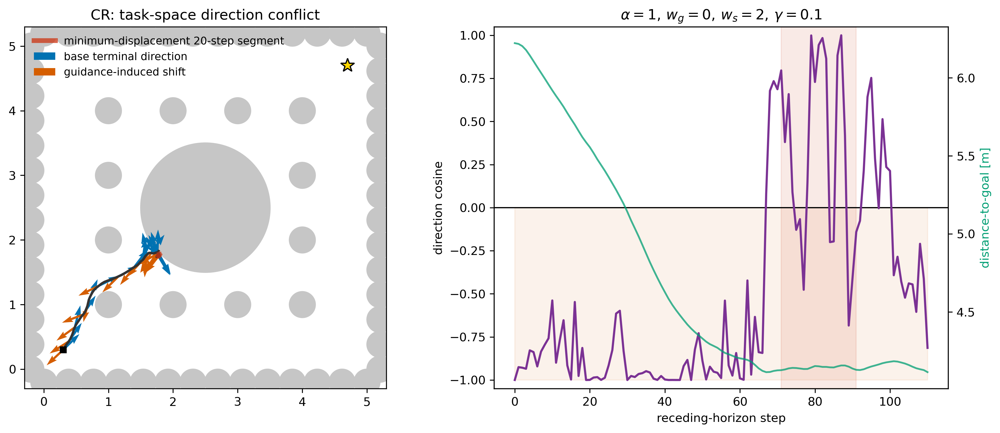

Opposition alone is not a failure certificate: the selected successful
episodes also had predominantly negative cosine. The useful signature is
opposition together with a plateau in goal distance. This is the concrete
distribution-shift failure that a soft reward sweep cannot certify away and
motivates verifier-driven expansion.

Regenerate:

```bash
python scripts/run_kazuki_absolute_coefficient_grid.py \
  --device mps --M 10 \
  --goal-coefficients 0 0.01 0.05 0.1 \
  --safe-coefficients 0.5 1 1.5 2 \
  --alphas 0.1 0.5 1 2
python scripts/paper_kazuki_alpha_grid.py
python scripts/diagnose_kazuki_guidance_conflict.py \
  --alpha 1 --goal-coef 0 --safe-coef 2 \
  --gamma 0.1 --rollout-index 3
```

The full retained archives are in
`provenance/paper_baselines/kazuki_alpha_fine_grid_m10/`. The metric and
diagnostic JSON sidecars define the exact selected episodes and measurements.

## High-\(\alpha\), high-\(w_s\) wall-route search

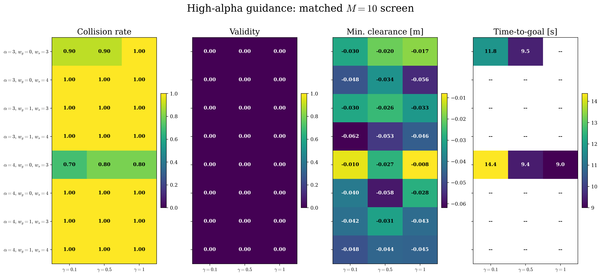

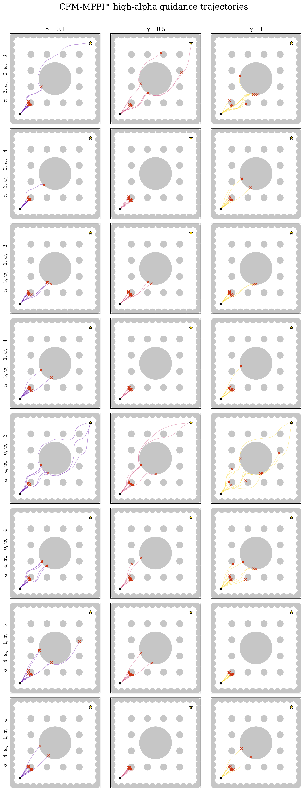

The matched \(M=10/\gamma\) screen compares exactly eight arms:

\[
\alpha\in\{3,4\},\qquad w_g\in\{0,1\},\qquad w_s\in\{3,4\},
\qquad \gamma\in\{0.1,0.5,1\}.
\]

All eight arms had zero trajectory Validity. Six had zero success at every
\(\gamma\). The only nonzero-SR arms were

| \((\alpha,w_g,w_s)\) | SR at \(\gamma=.1/.5/1\) |
|---|---|
| \((3,0,3)\) | \(0.1/0.1/0.0\) |
| \((4,0,3)\) | \(0.3/0.2/0.2\) |

Setting either \(w_g=1\) or \(w_s=4\) caused every retained episode to
collide, usually within 12--20 receding-horizon steps. Large \(\alpha\) is
permissive in the standard CBF inequality, while large \(w_s\) scales a
globally normalized soft gradient; neither creates a safety certificate.

Because \(M=10\) could miss a rare outer route, the promising
\((4,0,3)\) arm was additionally screened with \(M=50/\gamma\). Its SR was
\(0.06/0.08/0.12\). The most wall-following success remained seed 7 at
\(\gamma=1\): only \(12.7\%\) of transit states were within 0.6 m of the
task-space boundary, with mean boundary distance 0.96 m. It briefly follows
the bottom wall zone, then turns around the giant obstacle; it is not a full
wall-hugging route.

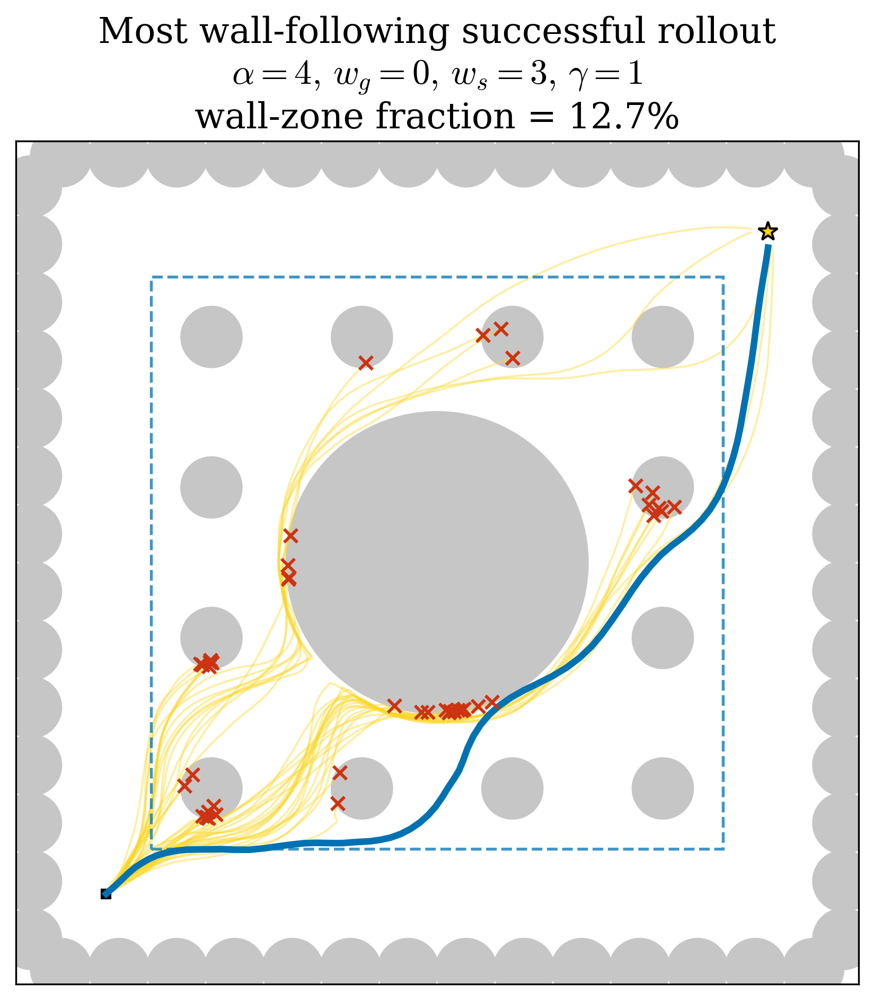

The \(M=50\) search is diagnostic only and is not mixed into the eight-arm
metric comparison. Exact archives and seed contracts are retained under
`provenance/paper_baselines/kazuki_alpha34_wall_grid_m10/` and
`provenance/paper_baselines/kazuki_alpha4_wg0_ws3_wall_search_m50/`.
