# Safe Flow Expansion Working Book

This directory is the standalone working record for the current SafeMPPI → conditional flow matching → Safe Flow Expansion pipeline. It is intended for a new collaborator who has not followed the experiment history, and for later paper writing where every claim must point to a source file, an authenticated artifact, or an explicit limitation.

The exact Phase C source snapshot comes from Git commit `e63ebd80e5fa4f712a1a7cf590ec74c116768873`. The current coverage-aware selected checkpoint is `opt032_demo0250@r25`, not the final round. Its SHA-256 is `ab6ce3c39671554ef114234c464f23cc18828ea751a4bbb5547beb59793c1b54`.

## TL;DR: A → B → C

This section is append-only. Add a dated item here whenever a new sweep, visualization, failure, or promoted model changes the working conclusion.

| Phase | What changed | What it answered | What remained wrong |
|---|---|---|---|
| **A — establish the task and diagnose update instability** | Rebuilt the low7 pretraining data over the full free-space start grid; added the closest-obstacle-boundary vector; moved from the radius-0.3 OOD task to the canonical radius-1.0 giant obstacle; screened the $2\ell\times3\alpha\times4\text{ steps}\times2\text{ execution rules}$ matrix; separated raw evaluation from tilted gathering; introduced the nominal-$H_P$ one-step execution gate. | The radius-0.3 task was largely recoverable, while the giant obstacle exposed the real failure. Large per-round CFM updates caused successful-mode forgetting; the margin execution rule collected much longer trajectories than progress execution; visualization and raw evaluation, not gather statistics, exposed the collapse. | One rollout lineage could dominate a round. Most gathered positives came from repeatedly traversing one route. A valid $H$-step window was not the same as a viable closed-loop trajectory. Negative-loss variants and optimizer-dose changes did not by themselves solve route collapse. |
| **B — sample-complete, parallel, lineage-balanced V2** | Used independent synchronous replicas per $\gamma$, $K=16,B=4$, adaptive per-round acquisition temperature, 64 calibration contexts per $\gamma$, $W=2$, all eligible positives once per exact epoch, and equal mass over $\gamma\rightarrow\text{episode lineage}\rightarrow\text{context}\rightarrow\text{query}$. | Raw SR rose from 34.3% at round 0 to 78.6% at round 7 in the M10 screen. The bookkeeping fixes worked: all positive windows were used once, long episodes and positive-rich contexts no longer received automatic extra loss mass, and training U/R counts became balanced. | Raw successful-route balance still collapsed from 0.686 at round 0 to 0.029 at rounds 7 and 10. Balanced queried/training populations did **not** imply balanced probability mass under the raw generator. |
| **C — support-preserving V3, current snapshot** | Kept the Phase B sampling/replay structure, swept fixed optimizer steps $\{16,32\}$ and authenticated expert-demo objective mass $\{0,0.125,0.25\}$, froze the visual encoder, and selected checkpoints using a coverage-aware raw M10 objective before a disjoint raw M50 confirmation. | `opt032_demo0250@r25` improved disjoint M50 raw SR from 36.0% to 66.57%, CR from 64.0% to 33.43%, and $V_{\rm safe}$ from 11.14% to 37.71%. Demo mass 0.25 preserved task success better than no-demo or 0.125. | Coverage did not survive confirmation: successful routes changed from U/R = 71/55 at round 0 to 201/32 at round 25, and $J$ fell from 29.14% to 18.29%. By round 100 SR was 73.14% but $J$ was only 9.71%. Demo and positive gradients conflicted strongly (cosine $-0.7532$). Phase C is a validated negative result about density transfer, not a solved expansion algorithm. |

The current conclusion is precise: **Safe Flow Expansion increased local verified-window support and raw task success, but the learned generator did not preserve both global route modes.** Equalizing the replay measure fixes sample accounting; it does not impose symmetry or global homotopy coverage on $p_\theta(U\mid c)$.

## What is in this folder

```text
safe_flow_expansion_workbook/
├── README.md                       # pipeline, equations, results, and limitations
├── CODE_INDEX.md                   # per-file role and blind-spot map
├── SOURCE_MANIFEST.json            # hashes for the frozen source and packaged assets
├── assets/
│   ├── data/                       # start/goal and expert/pretraining visualizations
│   ├── polytopes/                  # nominal/verifier polytope PNG, GIF, and MP4
│   └── results/                    # current Phase C report, gallery, and diagnostic video
├── checkpoints/
│   ├── low7_pretrained_checkpoint.pt
│   └── phase_c_selected_r25.pt
├── configs/                        # selected exact recipe and RBF calibration
├── provenance/                     # data, pretraining, Phase B reference, and Phase C manifests
├── scripts/                        # package verification and Helios data-link helpers
├── source_snapshot/                # exact Phase C code plus its practical import closure
└── tests/                           # focused verification entry point
```

The 4.38 GB training tensor is intentionally not duplicated in Git. On Helios it remains at its authenticated canonical path and is connected through `scripts/link_helios_data.sh`. The manifest, SHA-256, split, checkpoint, visualizations, and all code needed to interpret it are included here.

## Full pipeline at a glance

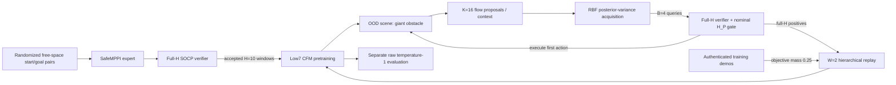

Three distributions must never be confused:

1. **Gathering controller distribution:** uncertainty-tilted selection of (B) verifier queries, followed by a verified execution rule.
2. **Training distribution:** verified (H)-step targets in the (W=2) replay window plus a declared offline demonstration objective.
3. **Scientific evaluation distribution:** raw, untilted temperature-1 samples from the checkpoint. It uses no RBF estimator, verifier acquisition, execution filter, SafeMPPI fallback, or expert.

## 1. Dynamics, task, and scenes

The robot is a planar double integrator. State and action are

\[
x_t=(p_t,v_t)\in\mathbb R^4,\qquad u_t\in[-1,1]^2,
\]

with $\Delta t=0.1$ s and

\[
p_{t+1}=p_t+\Delta t\,v_t+\tfrac12\Delta t^2u_t,
\qquad
v_{t+1}=v_t+\Delta t\,u_t.
\]

Every model sample is a horizon-(H=10) acceleration window

\[
U_t=(u_{t\mid t},\ldots,u_{t+H-1\mid t})\in\mathbb R^{10\times2}.
\]

Only $u_{t\mid t}$ is executed. The state is observed again and the model replans.

### In-distribution pretraining scene

- Workspace: $[0,5]\times[0,5]$.
- Ordinary stadium: the radius-0.2 obstacle/wall layout encoded in the data manifest.
- Goal is fixed at ((4.7,4.7)) for the retained dataset; starts cover the full free-space grid and include the former diagonal region.
- Start velocity is zero.
- Seven conditioning levels: $\gamma\in\{0.1,0.2,0.3,0.4,0.5,0.7,1.0\}$.
- Seed acceptance requires at least 0.05 m geometric clearance. The retained minimum was 0.050752 m.

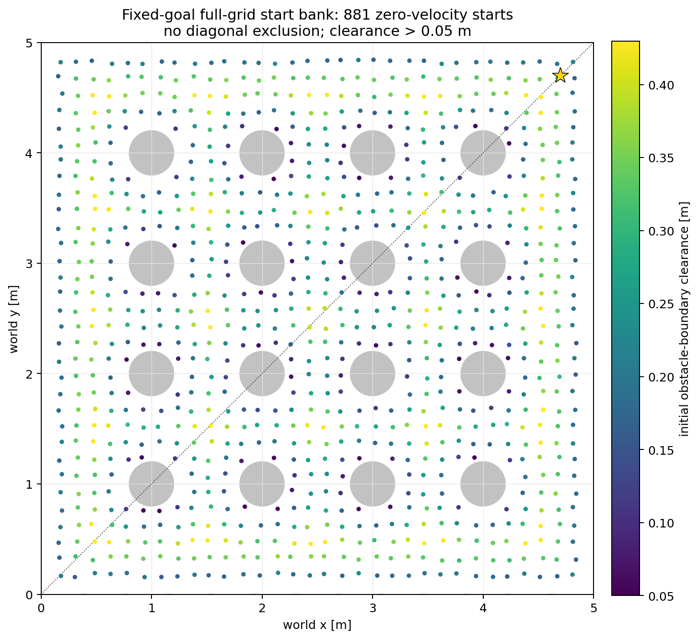

### Phase C OOD scene

The canonical endpoint pair is (p_0=(0.3,0.3)), (p_g=(4.7,4.7)). Four central radius-0.2 disks are replaced by one unseen radius-1.0 obstacle centered at ((2.5,2.5)). The source profile is `low7_radius1_canonical_v1`; its scene SHA-256 is `356d6d48b3af2b017b529562b530f35285c86f9107da512a73de6ef664b03e72`.

This is the Phase C scientific task. The radius-0.3 scene was useful during development but is not silently mixed into the current result.

## 2. SafeMPPI expert specification

SafeMPPI provides demonstrations during pretraining only. It is **not** a fallback during expansion or raw evaluation.

The exact expert configuration used for the low7 data has:

| Quantity | Value |
|---|---:|
| Horizon / integration step | $H=10$, $\Delta t=0.1$ |
| MPPI samples | 512 |
| Control noise std. per axis | (0.8660254) |
| Action bound | ([-1,1]^2) |
| MPPI temperature | 0.1 |
| Nominal polytope sensing radius | 2.0 m |
| Base polytope directions | 16 |
| Safety margin / extra margin | 0 / 0 |
| Warm start | on |
| Centroid gain / smoothing / epsilon | 0.2 / 0.25 / 0.15 |
| Proposal attempts per control step | at most 2 |
| Episode limit / goal reach radius | 800 / 0.15 m |

Data collection uses a noise-variance multiplier of 3 and smoothness weight 0.12. The expert first constructs its nominal robot-centered polytope and rejects sampled trajectories that violate its discrete-time barrier level sets. Its cost then selects the MPPI action distribution. For the training record, the exact procedure is:

1. Run the SafeMPPI proposal at the current state.
2. Submit planned (H=10) windows to the full fitted-polytope verifier.
3. Among full-H verified plans, select the one with maximum H-window goal progress.
4. Save that **planned and verified** H10 window as a training target.
5. Execute only its first action and replan.

Debug samples and unverified tails do not enter the pretraining tensor.

The expert trajectories below overlay all seven (gamma) values over the randomized start set.

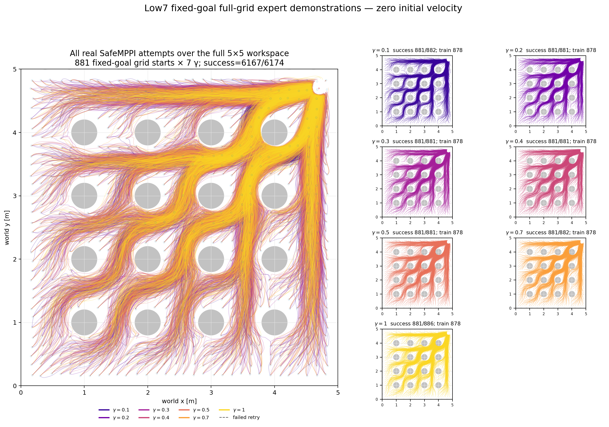

## 3. Nominal polytope and verifier polytope

These are related but different objects.

### Nominal SafeMPPI polytope

At a current robot center (c), the planner constructs faces

\[
\mathcal P(c)=\{p:A p\le b\},\qquad
m_k=b_k-a_k^\top c>0.
\]

Its normalized barrier is

\[
H_P(p)=\min_k\frac{b_k-a_k^\top p}{m_k},
\]

so $H_P(c)=1$, $H_P=0$ on a face, and $H_P\ge0$ inside the nominal polytope. SafeMPPI applies the discrete-time condition

\[
H_P(p_{i+1})\ge(1-\gamma)H_P(p_i).
\]

Small $\gamma$ is more conservative because the barrier level must be retained more strongly; $\gamma=1$ reduces the one-step condition to remaining inside $H_P\ge0$.

### Full fitted-polytope verifier

For a proposed trajectory, the verifier fits separating faces using an SOCP and then checks all planned steps. It uses

\[
\alpha_i=(1-\gamma)^i,\qquad \beta_i=1-\alpha_i,
\]

and certifies the complete H-step trajectory against the fitted faces. This fitted verifier polytope can differ from the nominal planner polytope. Therefore:

- nominal (H_P) is a planner/execution condition;
- the fitted SOCP certificate defines the full-H positive label;
- neither is a learned probability;
- a verified window is still only a finite-horizon statement, not a guarantee that future replanning will remain viable.

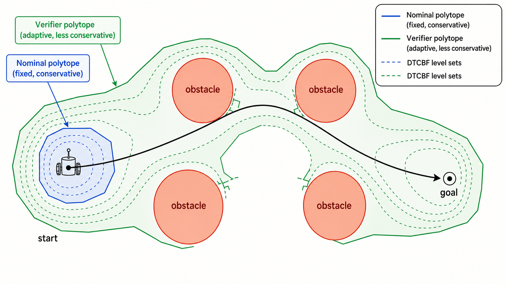

The exact replay below shows the nominal polytope in blue and the fitted verifier polytope in green for $\gamma\in\{0.1,0.5,1.0\}$:

- [Exact nominal/verifier replay MP4](assets/polytopes/low7_exact_polytope_replay.mp4)
- [Replay manifest](provenance/data/low7_exact_polytope_replay_manifest.json)

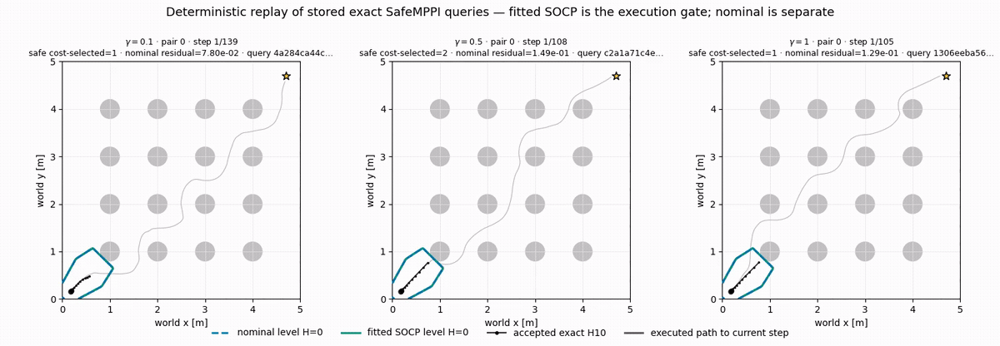

The following supplementary animation isolates the γ-dependent nominal SafeMPPI level sets:

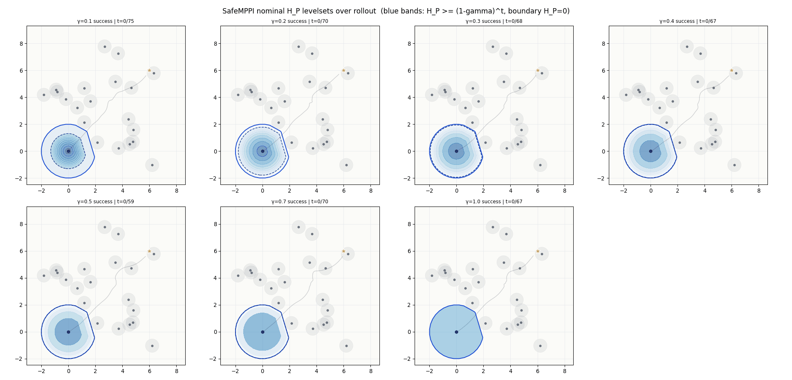

## 4. Low7 pretraining data

The authenticated dataset contains:

| Item | Count |
|---|---:|
| Retained free-space start/goal pairs | 881 |
| Target-bearing unique pairs | 878 |
| Verified trajectories per $\gamma$ | 878 |
| Total trajectories | 6,146 |
| Verified H10 windows | 341,968 |
| Training pair IDs / target-bearing trajectories per $\gamma$ / windows | 865 / 862 / 335,454 |
| Validation pair IDs / trajectories per $\gamma$ / windows | 16 / 16 / 6,514 |
| Train-validation pair leakage | 0 |

The grid begins from 32×32 cell centers with a deterministic uniform jitter of 0.02 m and retains every valid free-space start. There is no diagonal exclusion. Three training-split pair IDs produced no targets; all 16 validation pair IDs produced targets. Pair-level splitting prevents windows from the same start/goal pair from leaking across training and validation.

The dataset SHA-256 is

```text
4b8e2d9be794584fad232bcc46cf78c2c4f422efb3e0642f503c8a77fcd2e8ec
```

The exact tensor is 4,383,117,492 bytes and stays outside Git. See `provenance/data/manifest.json` and `scripts/link_helios_data.sh`.

Important limitation: the base dataset is spatially broad but was not constructed as exact reflection pairs and does not contain route labels. Approximate U/R balance in demonstrations therefore does not enforce reflection equivariance or equal density on the two global homotopy classes.

## 5. Conditional flow model

### Conditioning input

The current model conditions on 39 values:

\[
c_t=\big[\underbrace{(p_g-p_t)/5}_{2},
\underbrace{v_t/2}_{2},
\underbrace{d_{\rm boundary}(p_t)/5}_{2},
\underbrace{\gamma}_{1},
\underbrace{E_g(H_P\text{ grid})}_{32}\big].
\]

The closest-boundary vector points from the robot to the closest obstacle **boundary**, not its center. The visual encoder reads the clipped nominal-$H_P$ channel from a robot-centered 32×32 grid and emits 32 features. Occupancy and mask channels may exist in the interface but are not used by this checkpoint. Action history is also disabled.

### Architecture

- Output/design object: $U\in\mathbb R^{10\times2}$, flattened to 20.
- Flow input: noised plan 20 + context 39 + Fourier time 32 = 91.
- Trunk: $91\rightarrow160\rightarrow96\rightarrow32$, SiLU activations.
- Head: $32\rightarrow20$.
- The 32-dimensional penultimate trunk value at flow time $s=0.9$ is $\phi_s$.
- Total parameters: 70,308.

The pretrained checkpoint was trained from scratch for 500 epochs, batch size 512, Adam learning rate $3\times10^{-4}$; the selected validation checkpoint is epoch 462 with CFM validation loss 0.89463. The encoder is trainable during pretraining and frozen during Phase C expansion.

### Conditional flow matching objective

For a verified action window $U=x_1$, sample $x_0\sim\mathcal N(0,I)$ and $\tau\sim\mathrm{Uniform}(0,1]$, then interpolate

\[
x_\tau=(1-\tau)x_0+\tau x_1.
\]

The target velocity is $x_1-x_0$, and the training loss is

\[
\mathcal L_{\rm CFM}(\theta)
=\mathbb E\left[
\left\|v_\theta(x_\tau,\tau,c)-(x_1-x_0)\right\|_2^2
\right].
\]

At sampling time, the ODE initialized at $x_0\sim\mathcal N(0,I)$ is integrated for NFE=8 in Phase C.

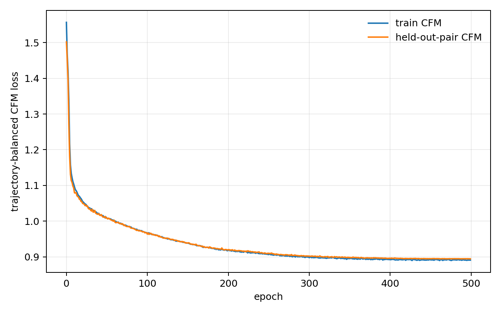

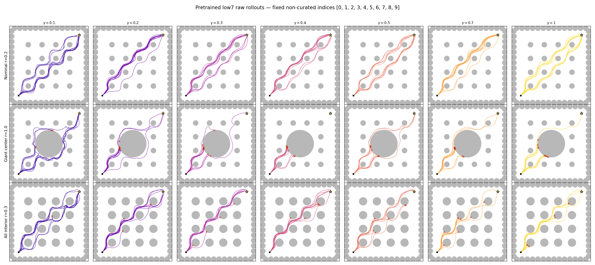

## 6. Phase C Safe Flow Expansion

Phase C is a single AFE arm. There is no proximal arm, fallback, curriculum, recovery start, rollback, negative loss, or online expert call.

### 6.1 Round and context notation

- $n\in\{1,\ldots,100\}$: expansion round.
- $g$: one of seven $\gamma$ values.
- $e\in\{1,\ldots,8\}$: independent closed-loop replica for that $\gamma$.
- $t$: receding-horizon control time within one replica, at most $T=300$.
- $c_{n,g,e,t}$: current model context.
- $U^{(j)}\sim p_{\theta_n}(\cdot\mid c)$, $j=1,\ldots,K$, with $K=16$.

The 56 replicas in a round are advanced synchronously. NVP terminates only the affected replica; it does not terminate the other replicas or the whole round.

### 6.2 Evolving representation and RBF uncertainty

At the start of round $n$, the current model produces normalized embeddings

\[
z_n(U,c)=\frac{\phi^{(n)}_{s=0.9}(U,c)}
{\|\phi^{(n)}_{s=0.9}(U,c)\|_2}.
\]

The visual encoder is frozen, but the flow trunk/head—and therefore $\phi_s^{(n)}$—evolve across rounds. The current representation is held fixed during one round's gathering.

The RBF kernel is

\[
k_n(z,z')=\exp\!\left(-\frac{\|z-z'\|_2^2}{2\ell^2}\right),
\qquad \ell=0.2256188330740796.
\]

The base length scale is the mean pairwise distance of exactly 50 normalized pretrained embeddings; Phase C uses multiplier 1.0. With observation regularizer $\lambda=0.01$, the latent marginal posterior variance relative to GP memory $Z_n$ is

\[
v_n(z)=1-k(z,Z_n)^\top
\big(K(Z_n,Z_n)+\lambda I\big)^{-1}k(Z_n,z).
\]

The acquisition code adds observation noise and normalizes by the prior noisy variance:

\[
s_{n,1}(z)=\frac{v_n(z)+\lambda}{1+\lambda}\in[0,1].
\]

Here $Z_n$ contains at most 512 full-H positive locations from the current and immediately previous round ($W_{\rm GP}=2$), sampled without replacement with round/$\gamma$/replica/context balance and re-embedded under the current model. Only verifier-positive sequences enter this GP memory. SOCP errors enter neither the GP nor the labeled archive.

The class also exposes $\sqrt{v_n}$ as `sigma()` for diagnostics, but the active sequential acquisition uses the normalized **variance** score $s$, not posterior standard deviation. This score is **representation-space novelty**, not a validity probability and not a safety certificate.

### 6.3 Sequential verifier acquisition

For each context, the model produces $K=16$ plans. The algorithm selects $B=4$ plans sequentially. Let

\[
C_1=K_{XX}+\lambda I
-K_{XZ}\big(K_{ZZ}+\lambda I\big)^{-1}K_{ZX}
\]

be the noisy candidate covariance after conditioning on GP memory. After choosing pending candidate $j_b$, the remaining covariance is updated by the Schur complement. The step-$b$ score is $s_{n,b}(j)=[C_b]_{jj}/(1+\lambda)$. The acquisition samples

\[
\pi_{n,b}(j)
=\frac{\exp\left((s_{n,b}(j)-\max_k s_{n,b}(k))/\beta_n\right)}
{\sum_k\exp\left((s_{n,b}(k)-\max_l s_{n,b}(l))/\beta_n\right)}.
\]

Pending conditioning uses a Schur-complement update, so selecting one candidate discourages selecting an RBF-near duplicate within the same B-budget. The selected plan is not labeled until the full verifier runs.

The temperature $\beta_n$ is recalibrated once per round on a beta-neutral deterministic context bank: 64 contexts per $\gamma$, equalized across $\gamma$. It targets median

\[
\frac{\mathrm{ESS}}{K}
=\frac{1}{K\sum_j\pi_j^2}=0.5.
\]

Then $\beta_n$ is frozen during round $n$. ESS calibration controls tilt strength; it does not guarantee useful geometric diversity.

### 6.4 Labels, execution, and NVP

Every successfully solved selected-B query enters the cumulative labeled archive

\[
\mathcal D=\{(c_i,U_i,s_i,m_i,r_i,\text{lineage}_i)\}.
\]

The positive archive is

\[
\mathcal D^+=\{(c_i,U_i):s_i=1\},
\]

where (s_i=1) means full-H task-space and SOCP certification. Progress (r_i) and certificate margin (m_i) remain separate fields; they do not redefine the positive label.

Among full-H verified selected-B plans, Phase C applies the nominal first-step gate

\[
H_P(p_{t+1})-(1-\gamma)H_P(p_t)\ge-10^{-8}.
\]

It executes the first action of the gated plan with maximum one-step (H_P) margin; one-step goal progress is only the tie-break. If no plan passes, that replica terminates as `NO_VERIFIED_POSITIVE` (NVP). No expert action is inserted.

### 6.5 W=2 sample-complete hierarchical replay

The cumulative archive is retained for audit, but the update uses full-H positives from only the current and preceding round:

\[
\mathcal D^+_{n,W=2}=\mathcal D^+_{n-1}\cup\mathcal D^+_n.
\]

Every eligible positive is used exactly once in an epoch. “Use every sample” does not mean one Adam update per sample: the exact epoch is partitioned into 32 mass-balanced macro-batches, each causing one optimizer update.

The positive loss measure assigns equal nested mass to:

1. each active (gamma);
2. each $(\text{round},\text{replica})$ episode lineage within that $\gamma$;
3. each context within that lineage;
4. each positive query within that context.

Conceptually, for query (q) in context (c), episode (e), and gamma (g),

\[
\mu_q
=\frac{1}{|G^+|}
\frac{1}{|E_g^+|}
\frac{1}{|C_{g,e}^+|}
\frac{1}{|Q_{g,e,c}^+|}.
\]

This removes three accidental effects: long episodes do not automatically dominate; positive-rich contexts do not receive more total mass; and one (gamma) does not dominate merely because it generated more windows. Groups with zero positives cannot receive positive CFM mass; that is an explicit limitation.

### 6.6 Offline demonstration support

The selected arm uses demonstration objective mass (f=0.25):

\[
\mathcal L_{\rm update}
=(1-f)\mathcal L_{\rm positive}+f\mathcal L_{\rm demo},
\qquad f=0.25.
\]

The demo source is the authenticated **training split** of the low7 dataset, augmented as exact x/y-reflection pairs with shared CFM noise and flow time. It is not a new SafeMPPI call at the current expansion context. Demo samples never enter (mathcal D), (mathcal D^+), RBF memory, beta calibration, acquisition counts, execution, or evaluation.

Phase C uses 32 Adam steps per round, learning rate (10^{-5}), global gradient clipping at 1.0, and a frozen visual encoder. `negative_alpha=0`, so the update is exactly positive/demo CFM; the stored NVP-negative archive has no gradient effect.

### 6.7 One complete Phase C round

```text
freeze current round model snapshot
re-embed W=2 positive GP memory; cap at 512
calibrate beta_n to median ESS/K = 0.5 on balanced contexts

for gamma in seven levels and replica in 8 synchronous replicas:
    until goal, NVP, or T=300:
        sample K=16 action windows from p_theta_n(U | c)
        sequentially acquire B=4 by RBF posterior variance
        run the full verifier on all four queries
        append every solved query to D; append full-H positives to D+
        gate verified plans by nominal one-step H_P
        execute first action of maximum-H_P-margin plan
        if no candidate remains: terminate this replica as NVP

form current+previous-round full-H positive replay
assign gamma/episode/context/query equal loss mass
partition every eligible positive exactly once into 32 macro-batches
combine positive CFM with 0.25 authenticated demo CFM
take 32 Adam steps at lr=1e-5; keep visual encoder frozen
save checkpoint and diagnostics
```

## 7. Evaluation contract

Training/gathering metrics are diagnostics, not policy evaluation. Phase C evaluation reloads stored checkpoints and performs raw temperature-1 generation with fixed common-random-number seed banks.

- No RBF/uncertainty tilt.
- No selected-B verifier acquisition.
- No nominal-(H_P) execution filter.
- No expert or fallback.
- Collision, success, timeout, minimum clearance, time-to-goal, planned-window validity, and route class are measured from the raw generated policy.

Stage A of the V3 sweep screened checkpoints at rounds (0,25,50,75,100) with M=10 per (gamma). The declared selection metric was

\[
C_\gamma=\frac{2\min(N_{U,\gamma}^{\rm succ},N_{R,\gamma}^{\rm succ})}{M},
\qquad
J=\frac1{7}\sum_\gamma C_\gamma.
\]

The globally selected checkpoint was then evaluated on a **disjoint** M=50 seed bank at rounds 0, selected, and 100. Wilson intervals are used for binomial rates and bootstrap intervals for continuous metrics.

Route U/R is a diagnostic based on the sign of early cross-track displacement relative to the canonical start-goal line, with a 0.05 m ambiguity band. It is not a topological homotopy certificate. This local diagnostic can appear balanced in training even when raw completed trajectories use one global side of the giant obstacle.

## 8. Current validated result

The V3 screen selected `opt032_demo0250@r25`. The disjoint M50 confirmation pooled 350 raw rollouts per checkpoint:

| Checkpoint | $J$ | SR | CR | $V_{\rm safe}$ | $V_{\rm full}$ | successful U/R |
|---|---:|---:|---:|---:|---:|---:|
| Pretrained r0 | 29.14% | 36.00% | 64.00% | 11.14% | 6.86% | 71 / 55 |
| Selected r25 | 18.29% | 66.57% | 33.43% | 37.71% | 14.00% | 201 / 32 |
| Final r100 | 9.71% | 73.14% | 26.86% | 47.71% | 9.71% | strongly U-biased |

For selected r25, SR Wilson 95% CI is 61.47–71.31%, mean minimum clearance is 0.01540 m (bootstrap 95% CI 0.01299–0.01778), and successful time-to-goal is 13.95 s (bootstrap 95% CI 13.64–14.28). There were no timeouts in 350 confirmation rollouts.

At r25, the expansion archive contained $D=406{,}296$ solved queries and $D^+=388{,}874$ positives. The update used 36,817 unique W2 positives exactly once across 32 optimizer steps. The RBF calibration gave $\beta=0.08974$, ESS/K=0.5447, and selected-versus-pool uncertainty uplift 0.0665.

For the active sequential acquisition, context-level “uplift” means

\[
\operatorname{uplift}(c)
=\operatorname{median}_{b=1,\ldots,B}
\left[
s_b(j_b)
-\operatorname{mean}_{j\in\mathcal R_b}s_b(j)
\right],
\]

where $\mathcal R_b$ is the remaining pool at sequential selection step $b$, and $j_b$ is the chosen candidate. The reported `uplift_med` is the median of these context-level values over the round. Positive uplift says acquisition chose more representation-space-uncertain plans than their contemporaneous remaining pools. It does **not** say those plans were safer, more useful, or globally route-diverse. The non-sequential compatibility path uses selected-mean minus pool-mean, but that path is not active in Phase C.

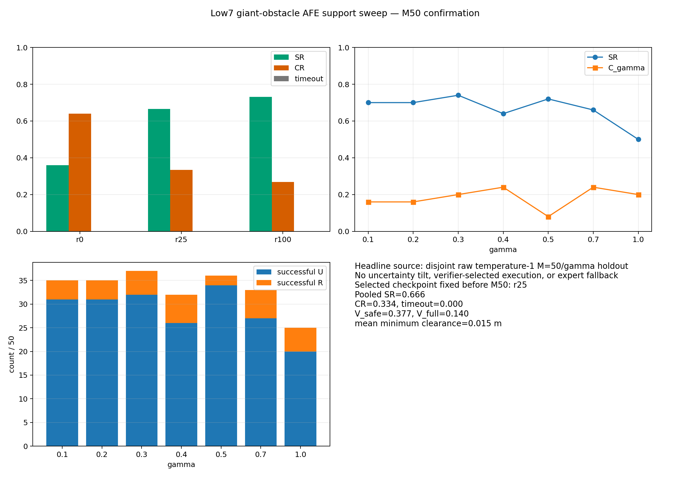

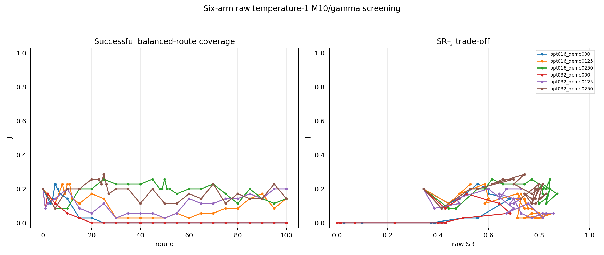

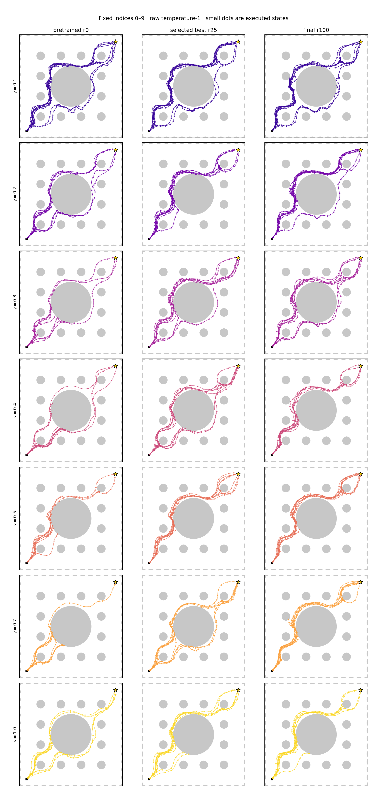

- [Selected Phase C expansion diagnostic MP4](assets/results/selected_expansion_diagnostic.mp4)
- [Selected training diagnostic](assets/results/selected_training_diagnostic.png)
- [Exact screening table](provenance/phase_c/screening_table.csv)
- [Disjoint M50 metrics](provenance/phase_c/metrics.jsonl)

## 9. What Phase C fixed—and what it did not

| Mechanism | Fixed or measured | Remaining blind spot |
|---|---|---|
| Eight replicas per (gamma) | Prevents one NVP from ending a whole round and samples multiple episode lineages. | All replicas still start from the same canonical state and can converge to the same closed-loop mode. |
| Sequential RBF acquisition | Avoids selecting RBF-near duplicates within one B=4 query budget. | (phi_s) distance need not correspond to global route/homotopy difference or future viability. |
| Adaptive ESS | Keeps acquisition tilt numerically non-uniform as uncertainty scale changes. | ESS controls concentration, not semantic usefulness. It cannot repair an uninformative representation. |
| GP memory (W=2), cap 512 | Avoids cumulative-kernel flattening and cubic growth on the full archive. | Forgetting older verified regions can cause repeated rediscovery; cap/window are explicit computational assumptions. |
| All W2 positives once | Eliminates the earlier 1–3% fresh-sample exposure problem. | CFM density transfer remains imperfect: balanced targets can still yield unbalanced raw density. |
| Hierarchical loss mass | Removes automatic dominance by long episodes, positive-rich contexts, or high-count gammas. | Zero-positive groups have no positive learning signal; equal local mass is not global mode preservation. |
| Nominal (H_P) margin execution | Aligns the executed first step with SafeMPPI's one-step level-set condition. | Maximizing local margin can favor long conservative lineages; finite-H validity still does not establish recursive feasibility. |
| Demo objective mass 0.25 | Reduces catastrophic task-success forgetting relative to no-demo arms. | Demo and positive gradients conflict; demonstrations were not exact U/R reflection pairs and do not enforce equivariance. |
| Frozen visual encoder | Preserves the pretrained obstacle representation and makes RBF embeddings less nonstationary. | If the pretrained representation omits the OOD geometry needed for route separation, freezing preserves that deficiency. |
| Raw disjoint evaluation | Exposes collapse hidden by gathering-controller statistics. | M50 per (gamma) is still finite; U/R is a task-specific local diagnostic. |

The central open problem is not sample bookkeeping anymore. It is **how to make verified support transfer into a raw conditional generator without concentrating probability on one globally successful route**. Any future solution should be judged by disjoint raw evaluation, not by D+ balance, CFM loss, ESS, or verified-controller survival alone.

## 10. Code map

The exact source tree is under `source_snapshot/`. The critical path is:

| File | Role | Primary blind spot |
|---|---|---|
| `codex_overnight/run_low7_rbf_v3_support_sweep.sh` | Fail-closed two-GPU launcher and host/GPU/codec gates. | Helios-specific Python path and physical GPU indices/UUIDs. |
| `analysis/low7_rbf_v3_support_sweep_driver.py` | Defines the six Phase C arms, runs them, screens checkpoints, confirms the winner, and produces delivery manifests. | Hard-coded Phase B reference paths; source hashes cover the critical path, not every transitive import. |
| `grid_expand_afe_rbf.py` | Main round loop: parallel proposals, RBF acquisition, verification, execution, archive, replay, and update. | Large legacy import graph and multiple protocol profiles in one file. |
| `afe_rbf_core.py` | RBF kernel, posterior covariance, GP memory selection, and sequential pending conditioning. | Representation distance is assumed to be meaningful for acquisition. |
| `afe_adaptive.py` / `afe2_calibration.py` | Adaptive beta and ESS calibration. | Numerical concentration control is not behavioral coverage control. |
| `afe_execution.py` | Nominal-(H_P) gate and first-action selection. | Local one-step margin is not recursive feasibility. |
| `afe_demo_support.py` | Authenticated training-demo sampling, exact reflection pairing, and mixed objective. | Reflection augmentation at update time does not make the architecture equivariant. |
| `afe_context.py` | Low7 context and closest-obstacle-boundary vector. | Only the closest boundary vector is explicit; multiple competing obstacle relations are compressed. |
| `grid_expand_afe2.py` | Shared policy loading, verifier, scene, rollout, and checkpoint utilities. | Historical compatibility makes its dependency graph broad. |
| `paper_results/low7_support_sweep_eval.py` | Fixed raw M10 checkpoint screen and r0 equivalence check. | Requires the Phase B reference cells for byte-level r0 equivalence. |
| `paper_results/low7_raw_m50_eval.py` | Disjoint raw M50 evaluation. | Route diagnostic is scene-specific. |
| `analysis/afe_rbf_sweep_diagnostics.py` / `video_afe2.py` | Training plots and expansion video. | These visualize gathering behavior; they must not be read as raw policy evaluation. |
| `afe_restart/stage2_low7_randomized.py` | Full-grid SafeMPPI data generation and verification. | Expensive 4.38 GB result and environment-specific multiprocessing. |
| `afe_restart/stage3_low7_pretrain.py` | Pair-disjoint, trajectory-balanced low7 CFM pretraining. | No architectural symmetry constraint or explicit route label. |
| `cfm_mppi/safegpc_adapter/safemppi.py` | SafeMPPI expert and nominal polytope barrier. | Expert fallback code exists in the general implementation even though Phase C forbids fallback. |
| `overnight_run_2026-07-01/verifier_polytope.py` | Fitted-polytope SOCP construction and certificate check. | Solver success/certificate is finite-horizon and depends on the fitted-face formulation. |

See [CODE_INDEX.md](CODE_INDEX.md) for the complete copied-file inventory, ownership boundaries, and additional blind spots.

## 11. Reproduction on Helios

### Verify packaged artifacts

```bash
cd /home/dohyun/projects/safeMPPI-phaseC-workbook/safe_flow_expansion_workbook
python scripts/verify_package.py
./scripts/link_helios_data.sh
```

Expected authenticated identities:

| Object | SHA-256 |
|---|---|
| Phase C source commit | `e63ebd80e5fa4f712a1a7cf590ec74c116768873` |
| Low7 dataset | `4b8e2d9be794584fad232bcc46cf78c2c4f422efb3e0642f503c8a77fcd2e8ec` |
| Low7 pretrained checkpoint | `7ae44f773b3f5fe36579c4101542e495119cf6e348f622f5edbfedaa2855a46c` |
| Pretrained model state | `070ea40dda8c94a7bec503942c48cb046f1dd7ef0bde8ccd00c3805b9a9af368` |
| Giant-obstacle scene | `356d6d48b3af2b017b529562b530f35285c86f9107da512a73de6ef664b03e72` |
| Selected Phase C r25 checkpoint | `ab6ce3c39671554ef114234c464f23cc18828ea751a4bbb5547beb59793c1b54` |

### Exact historical rerun

The frozen launcher is preserved, not rewritten:

```bash
export PYTHONPATH=/home/dohyun/projects/safeMPPI-phaseC-workbook/safe_flow_expansion_workbook/source_snapshot
export PYTHON=/home/dohyun/miniforge3/envs/cfm_mppi/bin/python

bash source_snapshot/overnight_run_07_06/rev_expansion/codex_overnight/run_low7_rbf_v3_support_sweep.sh \
  /home/dohyun/projects/afe2_runs/NEW_UNIQUE_OUTPUT_ROOT \
  GPU-50fb5dae-52a8-5843-bc81-b869586dccde \
  GPU-b5993142-760d-a6fe-9430-3d0e65203b6d
```

The launcher intentionally fails if the output directory exists, either GPU is shared, UUIDs do not match, source is dirty, the checkpoint/data hashes differ, or required codecs are absent. Historical code also expects the canonical Phase B reference evaluation and low7 dataset paths recorded in `CODE_INDEX.md`; both are present on the current Helios workspace. The package preserves those reference cells under `provenance/phase_b_reference/` for interpretation and future de-hardcoding.

Runtime recorded by the completed V3 sweep was 27,709 s (7 h 41 m 49 s) across two H100 GPUs. Python was 3.11.15, PyTorch 2.6.0+cu124, and NumPy 2.4.6.

## 12. Asset index

| Asset | What it establishes |
|---|---|
| `assets/data/fixed_goal_full_grid_starts.png` | The retained free-space start coverage and fixed evaluation goal. |
| `assets/data/full_space_all_gamma_trajectory_overlay.png` | Actual SafeMPPI expert trajectories over starts and (gamma). |
| `assets/data/low7_pretrained_fixed_index_gallery.png` | Raw pretrained qualification before OOD expansion. |
| `assets/data/low7_pretrained_metrics.png` | Pretrained per-(gamma) metrics. |
| `assets/polytopes/low7_exact_polytope_replay.mp4` | Exact blue nominal / green verifier polytope replay. |
| `assets/polytopes/low7_exact_polytope_replay.gif` | README-renderable copy of the exact nominal/verifier replay. |
| `assets/polytopes/safemppi_polytope_gammas.gif` | (gamma)-dependent nominal level-set behavior. |
| `assets/polytopes/verifier_vs_nominal_polytope_principle.png` | Geometric distinction between nominal and fitted polytopes. |
| `assets/results/report.png` | Latest V3 result summary. |
| `assets/results/screening_curves.png` | Raw fixed-seed checkpoint screen over all arms. |
| `assets/results/selected_raw_m50_gallery.png` | Disjoint raw M50 selected-checkpoint evidence. |
| `assets/results/selected_expansion_diagnostic.mp4` | Gathering/expansion behavior for the selected arm. |

## 13. Rules for the next update

When extending this workbook:

1. Add one dated bullet or row to the TL;DR before changing the interpretation elsewhere.
2. Record whether a number is gathering, verified-controller, raw screen, or disjoint raw confirmation.
3. Never call tilted acquisition “evaluation.”
4. Preserve the exact old recipe, checkpoint, source SHA, seed bank, and result manifest.
5. Add a blind spot beside every new mechanism; do not present a diagnostic intervention as a theorem or guarantee.
6. Promote a checkpoint only by a declared metric and confirm it on a disjoint seed bank.
7. Keep generated result directories outside Git; copy only the paper-relevant, hash-indexed assets here.

This workbook documents the current empirical method. It does not yet supply a probabilistic guarantee of closed-loop safety or recursive feasibility for an unknown post-trained flow model. The deterministic full-H verifier and fail-closed execution rule certify executed decisions during gathering; raw generator validity remains an empirical quantity measured under the stated evaluation contract.
